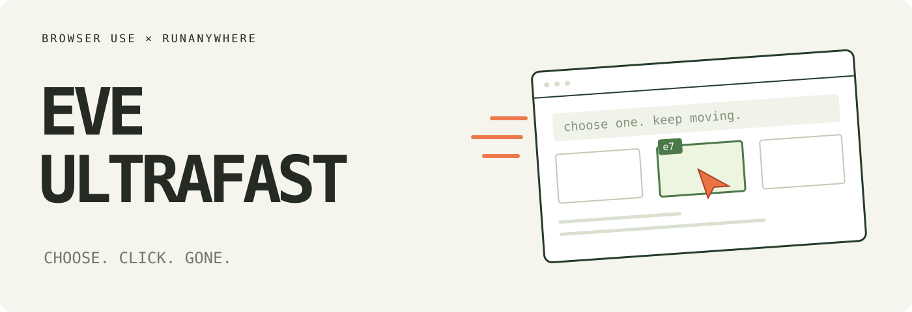
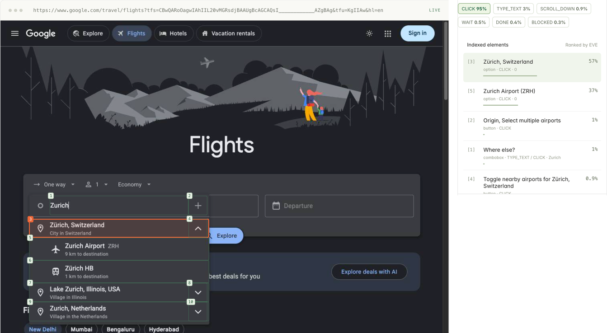

# EVE Ultrafast ⚡

**A browser agent with a dynamic, indexed action space, running on EVE.**

This is a fork of Browser Use's [jev-ultrafast](https://github.com/browser-use/jev-ultrafast). The loop is theirs. The decisions now come from [EVE](https://runwally.com), RunAnywhere's Jev-class decision model on Wally, built on Perplexity's open [pplx-decider-v1-27b](https://huggingface.co/perplexity-ai/pplx-decider-v1-27b). When the agent has to type into a field or open a website, DeepSeek V4.1 Flash on Wally writes the text or the address. One RunAnywhere key covers both.

Give it one goal, with or without a start page. EVE picks an operation and an element and puts a probability on every option. When it finishes, the text helper reads the final page and answers you: the product and its price, the number you asked for, or what is now on screen.



[How it was tested](docs/results.md) · [Design notes](docs/design.md) · [Read the loop](eve_ultrafast/agent.py)

## The action space

Every observation produces a new element table:

```text
[1] button "Change ticket type" value="Round trip" · CLICK
[2] combobox "Where from?" value="San Francisco" · TYPE_TEXT, CLICK
[3] combobox "Where to?" · TYPE_TEXT, CLICK
[4] checkbox "Nonstop only" (unchecked) · CLICK
...
```

The operations are `CLICK`, `TYPE_TEXT`, `SELECT`, `SCROLL_UP`, `SCROLL_DOWN`, `WAIT`, `PRESS_ENTER`, `GO_BACK`, `NAVIGATE`, `DONE`, and `BLOCKED`. The agent offers only operations and targets the page supports: `PRESS_ENTER` right after typing, `GO_BACK` once it has left a page. `NAVIGATE` opens a different website: EVE decides when, and the text helper writes the address.

```text
                        one EVE request
                     ┌───────────────────────────┐
page → element table → operation                 │
                     │ click_target              │
                     │ type_text_target          │
                     │ select_target, if present │
                     └─────────────┬─────────────┘
                         use the matching target
                                   │
                    CLICK [7] ─────┤──→ browser
                TYPE_TEXT [3] ─────┘
                          ↓
           DeepSeek V4.1 Flash → text → browser
```

Target questions are speculative. If EVE picks `CLICK`, only `click_target` can execute. Each target head holds only compatible elements, and native dropdown choices carry an observed element/option index.

The policy has no site-specific scripts and no prepared field strings. The Flights example supplies a goal and checks the outcome on its own.

## What changed for EVE

EVE serves the same System One request shape as Jev (`POST /v1/systemone`), so most of the loop moved over untouched. A few limits needed real changes:

- **26 options per question.** A Hacker News front page has 150+ links. The agent splits a large head into chunks of up to 25 elements, adds a `NONE` option to each, and asks them all in the same request. When one chunk answers with confidence and the rest point elsewhere, its leader wins. Otherwise a short final question compares the chunk leaders.
- **Shallow state.** System One state on Wally nests three levels deep at most, so the element table and the action history go in as text lines.
- **Plain words for control state.** EVE reads `(unchecked)` far better than `checked=false`. On the hotel fixture that one change took the "set the filter first" decision from a coin flip to 0.9.
- **Unsubmitted fields.** The state lists fields typed since the last button click, so EVE knows a typed search is not applied yet.

## Try it

```bash
curl -fsSL https://raw.githubusercontent.com/RunanywhereAI/wally/main/install.sh | sh
wally account login

git clone https://github.com/adityabatra072/eve-ultrafast.git
cd eve-ultrafast
uv sync
uv run eve
```

The agent reads the key `wally account login` saved. To use a key directly, `cp .env.example .env` and set `RUNANYWHERE_API_KEY`.

Open **http://127.0.0.1:8766** and click **Start demo → Run automatically**. The inspector shows numbered elements, operation probabilities, target probabilities, and executed actions. **Choose next** pauses before execution. Pick **Any website** to give it your own goal, with an optional start URL. Leave the URL empty and EVE opens the right site itself.

Chrome connects through [Browser Harness](https://github.com/browser-use/browser-harness), installed by `uv sync`. If one of your browsers already has remote debugging on (chrome://inspect → "Allow remote debugging"), the agent works in a background tab there. Otherwise it starts its own Chrome with a separate profile in `~/.cache/eve-ultrafast/chrome` on port 9333 and reuses it on later runs. Set `EVE_HEADLESS=1` to keep that window hidden, or `BU_CDP_URL` to use any other browser with a debugging port.

The text helper takes any OpenAI-compatible endpoint. Set `TEXT_MODEL`, `TEXT_MODEL_BASE_URL`, and `TEXT_MODEL_API_KEY` to swap it.

## Use the library

```python
from eve_ultrafast import Agent

with Agent(
    "https://www.google.com/travel/flights?hl=en",
    "Find one-way flights from Zurich to London on November 20, 2026, "
    "for one adult in economy. Stop when matching flight options are visible.",
) as agent:
    for state in agent.run():
        print(state["elapsed_ms"], state["status"])
```

Run it with `uv run --env-file .env python your_script.py`. Pass `None` as the URL and the agent starts from a blank tab. The same policy handles other tasks:

```bash
uv run --env-file .env python examples/run.py \
  --url https://en.wikipedia.org/wiki/Main_Page \
  --goal 'Find and open the Wikipedia article about Gödel’s incompleteness theorems.'

uv run --env-file .env python examples/run.py \
  --goal 'Go to Hacker News and open the comments of the top story.'
```

`uv run --env-file .env python examples/flights.py --keep-open` runs the flight search, checks the route, date and results on the final page, and saves its trace. It never selects or books a flight.

## Why it moves

- **One request per decision cycle** in the common case. Operation and target heads share the same observed state.
- **No screenshots in the agent loop.** EVE reads structured state. The inspector turns screenshots on for you to look at.
- **One browser call per snapshot.** The snapshot reads visible controls, names, values, and text atomically and keeps references to the actual DOM nodes.
- **Selected targets get validated.** Clicks check the document, form values, target, and nearby context, then resolve current geometry and reject covered controls before input.
- **Waits look for useful state.** After typing into a combobox, the agent waits up to 200 ms for visible suggestions. Other interactions get two animation frames or 50 ms.
- **The connection opens early.** The agent opens its HTTP/2 connection to Wally while the first page loads.

Every executed target resolves from an observed node. Model output never becomes selectors, coordinates, shell commands, or JavaScript. The text helper's output has to parse as a small JSON object before anything gets typed, and `NAVIGATE` only opens plain `http(s)` addresses with a host.

## Small enough to read

| File | Job |
| --- | --- |
| [agent.py](eve_ultrafast/agent.py) | The complete loop and text-helper handoff |
| [snapshot.js](eve_ultrafast/snapshot.js) | Atomic DOM snapshot, indexed controls, freshness guards |
| [browser.py](eve_ultrafast/browser.py) | Browser connection, current geometry, execution |
| [model.py](eve_ultrafast/model.py) | Operation/target heads on EVE, chunking, text generation |
| [questions.py](eve_ultrafast/questions.py) | Model instructions |
| [demo.py](eve_ultrafast/demo.py) | Local inspector |

## Limits

The agent works in one tab. Links that would open a new tab open in that tab instead, and a pop-up a click still opens gets loaded there and closed. Password fields work. The agent never reads a password back off the page, though one you put in the goal appears in the trace where it was typed. An element the browser refuses to operate (covered, disabled) is dropped for that page and EVE chooses again.

A `DONE` choice and its answer still deserve a check when it matters. The DOM reader handles common HTML and ARIA controls, not the full accessible-name spec. Shadow roots, frames, canvas, file uploads, nested scrolling, and arbitrary keyboard widgets stay outside it. `NAVIGATE` addresses come from the text helper's knowledge, so a guessed deep link can land on a missing page; the agent then works from there. Owned tabs share whichever Chrome profile you connect, including its logins.

Google Flights sometimes answers an automated search with "Oops, something went wrong". EVE clicks Reload, which usually recovers. If Google keeps refusing, the run ends `blocked` and the flight check fails.

## Development

```bash
uv run ruff check .
uv run pytest
node --check eve_ultrafast/static/app.js
node --check eve_ultrafast/snapshot.js
uv build
```

Tests run offline. `uv run python scripts/check_guards.py` checks real controls in a local browser without model calls. `uv run python scripts/live_suite.py` runs 33 tasks on public websites (shopping, search, reference, docs, GitHub, news, video, forms, login, a to-do app) and checks each result on its own; pass task names to run a few. Live examples, the suite, `scripts/smoke.py`, and the recording scripts make paid API calls. Credentials and raw traces stay out of git.

---

Built on [Browser Use](https://github.com/browser-use/browser-use)'s [jev-ultrafast](https://github.com/browser-use/jev-ultrafast) and [Browser Harness](https://github.com/browser-use/browser-harness). MIT licensed.
